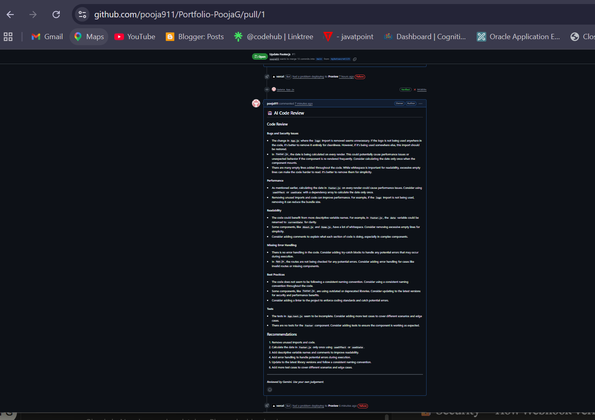

# 🤖 AI Code Review Bot

A GitHub bot that automatically reviews Pull Requests using Groq AI (Llama 3.3 70B) and posts structured feedback as comments — instantly, on every PR.

> Built with Node.js, Express, Octokit, and Groq AI.

---

## 📸 Demo




---

## 🚀 What It Does

1. Someone opens a Pull Request on GitHub
2. GitHub sends a webhook event to this server
3. The server fetches the code diff from the PR
4. The diff is sent to Groq AI in chunks for analysis
5. Groq's structured review is posted back as a comment on the PR — automatically

---

## 🧠 How It Works — Architecture

```
Developer opens PR on GitHub
         ↓
GitHub sends POST request (webhook) to /webhook
         ↓
webhook.js → verifies the request is genuine (HMAC-SHA256)
         ↓
github.js → fetches the code diff from GitHub API
         ↓
reviewer.js → splits diff into 8000-char chunks → sends each to Groq AI
         ↓
poster.js → posts combined review as a comment on the PR
         ↓
Developer sees AI review on their PR ✅
```

---

## 📁 Project Structure

```
ai-code-reviewer/
├── src/
│   ├── index.js       → Express server entry point
│   ├── webhook.js     → Handles & verifies GitHub webhook events
│   ├── github.js      → Fetches PR diffs via GitHub API
│   ├── reviewer.js    → Sends diff to Groq AI, returns review
│   └── poster.js      → Posts review comment back to GitHub
├── .env               → Secret keys (never committed)
├── .gitignore
└── package.json
```

---

## 🛠️ Tech Stack

| Tool     | Purpose                                                |
| -------- | ------------------------------------------------------ |
| Node.js  | JavaScript runtime — runs the server                  |
| Express  | Web framework — handles HTTP requests                 |
| Octokit  | GitHub's official SDK — fetch diffs, post comments    |
| Groq SDK | AI inference — generates code reviews                 |
| dotenv   | Loads secret keys from .env file                       |
| crypto   | Built-in Node.js module — verifies webhook signatures |

---

## ⚙️ Setup & Installation

### Prerequisites

* Node.js v18+
* A GitHub account and a test repository
* A Groq API key (free at console.groq.com)
* ngrok (for local development)

### 1. Clone the repo

```bash
git clone https://github.com/yourusername/ai-code-reviewer.git
cd ai-code-reviewer
```

### 2. Install dependencies

```bash
npm install
```

### 3. Set up environment variables

Create a `.env` file in the root:

```
GROQ_API_KEY=your-groq-api-key
GITHUB_TOKEN=your-github-classic-token
GITHUB_WEBHOOK_SECRET=any-secret-password-you-choose
PORT=3000
```

**Where to get each key:**

* `GROQ_API_KEY` → console.groq.com → API Keys → Create key (free)
* `GITHUB_TOKEN` → GitHub → Settings → Developer Settings → Tokens (classic) → check `repo` scope
* `GITHUB_WEBHOOK_SECRET` → make up any password (e.g. `mybotsecret123`)

### 4. Start the server

```bash
npm run dev
```

### 5. Expose your server with ngrok

```bash
./ngrok.exe http 3000   # Windows
ngrok http 3000          # Mac/Linux
```

Copy the `https://...` URL ngrok gives you.

### 6. Add webhook to GitHub

Go to your repo → Settings → Webhooks → Add webhook:

* **Payload URL:** `https://your-ngrok-url.ngrok-free.app/webhook`
* **Content type:** `application/json`
* **Secret:** same as `GITHUB_WEBHOOK_SECRET` in your .env
* **Events:** Pull requests only
* **SSL:** Disable (for local dev)

### 7. Test it!

Open a Pull Request in your repo — the AI review comment will appear within seconds.

---

## 🔐 Security — How Webhook Verification Works

Every request GitHub sends is signed with your `GITHUB_WEBHOOK_SECRET` using HMAC-SHA256.

When a request arrives:

1. GitHub's signature is read from the `x-hub-signature-256` header
2. Your server creates its own signature using the same secret
3. Both signatures are compared using `crypto.timingSafeEqual()`
4. If they match → genuine request ✅ If not → rejected with 401 ❌

`timingSafeEqual` is used instead of `===` to prevent timing attacks — where a hacker could guess the signature character by character by measuring response time.

---

## 🧩 Key Design Decisions

### 1. Respond to GitHub immediately, work asynchronously

```js
res.sendStatus(200); // tell GitHub "got it" immediately
// then do the slow AI work after
const diff = await getDiff(...);
```

GitHub times out webhooks after 10 seconds. Groq AI takes longer than that. So the server acknowledges GitHub instantly and does the review work in the background.

### 2. Chunked diff processing

Large PRs can have thousands of lines. Instead of truncating the diff (and missing bugs), the diff is split into 8000-character chunks. Each chunk is reviewed independently and the results are combined into one structured comment.

```
Diff (25,000 chars)
       ↓
Chunk 1 (0-8000)    → Groq → Review 1
Chunk 2 (8001-16000) → Groq → Review 2
Chunk 3 (16001-24000) → Groq → Review 3
       ↓
Combined into one PR comment
```

### 3. Classic GitHub token for reliability

Fine-grained tokens can have permission issues with the issues comments API. Classic tokens with `repo` scope are more reliable for posting PR comments programmatically.

---

## 💡 Concepts You'll Learn From This Project

| Concept               | Where it's used                          |
| --------------------- | ---------------------------------------- |
| HTTP servers          | Express in index.js                      |
| Webhooks              | GitHub sending POST requests to /webhook |
| REST APIs             | Octokit calling GitHub's API             |
| async/await           | Every API call that takes time           |
| HMAC-SHA256 security  | verifySignature() in webhook.js          |
| Chunking algorithms   | splitIntoChunks() in reviewer.js         |
| Environment variables | .env file for all secrets                |
| Error handling        | try/catch in webhook.js                  |
| Modular code design   | Each file has exactly one job            |

---

## 🎯 Interview Talking Points

**"Walk me through your architecture"**

> "The server is built with Express on Node.js. When a PR is opened, GitHub sends a POST request to my /webhook endpoint. I verify the request signature using HMAC-SHA256, extract the PR details from the payload, fetch the diff via Octokit, send it to Groq AI in chunks, and post the combined review back as a GitHub comment."

**"How do you handle large PRs?"**

> "Instead of truncating large diffs which would miss bugs in later parts of the code, I implemented a chunking system. The diff is split into 8000-character pieces, each reviewed independently, and the results combined into one structured comment."

**"How do you handle the 10-second GitHub webhook timeout?"**

> "I respond to GitHub with a 200 immediately, then do the slow AI work asynchronously. If I waited for Groq first, GitHub would think the delivery failed and retry it."

**"How do you prevent fake webhook requests?"**

> "Every GitHub webhook is signed with a shared secret using HMAC-SHA256. I verify this signature on every incoming request using Node's built-in crypto module. I use timingSafeEqual instead of === to prevent timing attacks."

**"What would you improve next?"**

> "I'd add a React dashboard showing review history and PR scores over time. I'd also use Groq's structured JSON output to score PRs by category — bugs, security, readability — instead of just free text."

---

## 🔮 Possible Extensions

* [ ] Deploy to Railway/Render so it runs 24/7 without your laptop
* [ ] Dashboard showing all reviewed PRs with scores
* [ ] Structured JSON output from AI — score each PR by category
* [ ] Config file per repo — teams customize review focus areas
* [ ] Support for multiple AI providers (Groq, Gemini, Claude)
* [ ] Slack notification when a review is posted

---

## 📚 What I Learned Building This

* How webhooks work and why they're better than polling
* How to verify request authenticity with HMAC signatures
* The async/await pattern for handling slow API calls
* Why you should always respond to webhooks immediately
* How to design modular code where each file has one job
* Real-world chunking strategies for handling large inputs

---

## 👩‍💻 Author

**Pooja Garg**

* GitHub: [@pooja911](https://github.com/pooja911)

---

*This project was built as a portfolio piece demonstrating AI integration, webhook handling, API design, and security best practices.*
